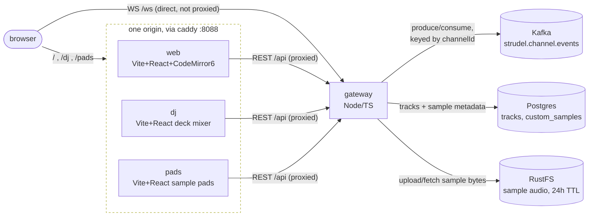
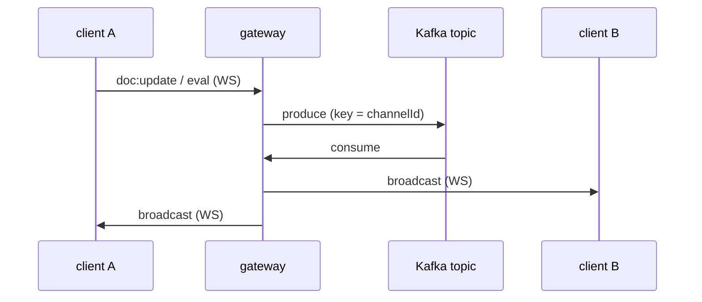

# strudel-point

A [flok.cc](https://flok.cc)-style collaborative live-coding room for [Strudel](https://strudel.cc),
with Kafka as the event backbone between clients, Postgres for saved tracks/metadata, and
RustFS (S3-compatible object storage) for user-uploaded audio.

## Architecture



Every client app speaks the same two protocols to the same gateway: **WebSocket `/ws`** for realtime room events, and **REST `/api`** for tracks and samples. `/ws` is the one exception to "browser never talks to the gateway directly" — it bypasses Caddy/Vite's proxy entirely (a proxied WS upgrade hangs forever under Bun's `http.request`), so the gateway's port is published straight to the browser. `/api` goes the normal route: browser → app's own Vite dev server → its proxy → gateway.

### Why events go through Kafka instead of a direct broadcast



The gateway never fans an event out on receipt — it only ever broadcasts what it *consumes back* off Kafka, including to the sender. That keeps behavior identical whether one gateway instance is running or ten, and gives a durable, replayable log for free.

Everything except the web container's own port is **internal to the Docker network** —
gateway talks to `kafka:9092`/`postgres:5432`/`rustfs:9000` by Docker's internal DNS, and the
browser never talks to the gateway directly; Vite's own server-side proxy does that from
inside the web container. The only host port that has to exist is the one the browser hits.

- **No CRDT.** Each channel/room has one shared buffer; edits are broadcast as full-content
  `doc:update` events, last write wins. Fine for a "everyone's looking at one editor"
  live-coding session; would need real conflict resolution (e.g. Yjs) for true multi-cursor
  concurrent editing.
- **Kafka is the only fan-out path.** The WS gateway never broadcasts directly on receipt —
  it publishes to Kafka, then broadcasts whatever it consumes back off the topic. This keeps
  behavior identical whether one gateway instance is running or several, and gives you a
  durable, replayable event log for free.
- **Audio happens per-browser.** Like flok.cc, nobody's audio is server-rendered — every
  client runs its own `@strudel/web` instance and locally evaluates whatever `eval` events
  come through, so everyone in the room hears the pattern.
- **Presence is best-effort.** There's no room roster fetched on join, so a client only learns
  about peers who join/leave *after* it connects. Fine for the MVP; add a small `GET
  /api/channels/:id/presence` (backed by an in-memory or Redis set) if you need an accurate
  peer list for people already in the room.

## `tracks` table

```sql
tracks (
  id            uuid primary key,
  channel_id    text,
  title         text,
  author        text,
  code          text,         -- raw source, as typed
  strudel_json  jsonb,        -- { code, cps?, tags?, version } — see packages/shared/src/tracks.ts
  created_at    timestamptz,
  updated_at    timestamptz
)
```

`strudel_json` is deliberately a superset of `code` (not just the string) so future fields —
tempo, tags, multi-pane layouts — don't need a schema migration, just a jsonb shape change.

## Custom sounds (drag-and-drop audio)

Dropping an audio file into the "my sounds" tab uploads it and registers it with Strudel by
name (`s("myclap")`), broadcasting to everyone else in the room over the same Kafka topic.

The audio bytes themselves live in **RustFS, not Postgres** — `custom_samples` only holds
metadata (name, size, mime type). This was a deliberate change from an earlier bytea-in-Postgres
version: uploaded audio is session-scoped, throwaway material, not something that should grow a
database backup forever. Instead:

- Bytes expire after a **fixed 24h**, via a bucket lifecycle rule (`apps/gateway/src/storage.ts`,
  `SAMPLE_TTL_DAYS`) — set once at startup, not per-upload. Unlike the Valkey-backed cache this
  replaced, that expiry is *not* refreshed on play: object storage has no last-accessed hook to
  reset against, so an actively-used sound can still age out mid-session at the 24h mark. If that
  turns out to matter in practice, it'd need an app-level "touch" on every play instead.
- The metadata row is deleted the moment its object is found expired (checked when the sidebar
  list loads, or on a playback 404) — so Postgres never accumulates dead rows either.
- Upload cap is 50MB — real object storage, not a RAM-backed cache, so this is a "keep it to one
  sample/loop" guard rail rather than a memory constraint.

If you want a custom sound to genuinely outlive 24h of inactivity, save it as part of a `Track`
(the `code` references the sample by name; re-upload the audio in a fresh session) — tracks and
custom sounds are deliberately different durability tiers.

## DJ mixing (`apps/dj`)

A separate app (own Vite dev server, own `docker-compose.yml` service) that turns a room's
*existing saved Tracks* into a two-deck DJ mixer. dj's whole job is playing tracks that
already exist — it never touches audio files or sample banks; that's `apps/pads`'s job
(below). A deck here holds a whole `Track`'s Strudel source, not decoded audio, so there's
no waveform, no bpm-guessing, no scrubbing — just code, played (and shaped) as whatever it
already is:

- **Decks play whole tracks** — each deck picks from this room's saved tracks and plays
  the pattern as-is, `.speed()`-shifted and optionally filtered.
- **hpf/lpf/lfo/duck knobs** — a highpass, a lowpass (with an lfo that sweeps its cutoff),
  and a "duck": a rhythmic, cycle-synced gain dip for a sidechain-pump feel. Explicitly
  *not* a true audio-reactive sidechain compressor — that would need an envelope follower
  actually listening to the other deck's live output, which is real Web Audio graph work
  Strudel's pattern language doesn't do. See `chain.ts`'s `DeckConfig` for the honest
  version this actually is.
- **Tempo** — a deck's effective tempo is whatever its track's own `setcps()` declared
  (parsed back out by `splitTrackCode`) times its `.speed()` knob; a track with no
  declared tempo falls back to a default rather than guessing one. "sync" matches a
  deck's speed to whichever deck is "master".
- **Crossfader** — equal-power crossfade between the two decks' gains.
- **A hard "cut"** — Strudel's `evaluate()` only affects what gets scheduled *going
  forward*; it never retroactively silences a track already sounding, and there's no
  per-deck kill switch in Strudel's public API. "cut" is the honest version of "stop
  immediately": it hushes the whole mix for an instant, marks that deck stopped, and lets
  the next debounced re-evaluate bring the other deck back in without it.
- **Show code** — a toggle reveals the actual Strudel driving the live mix (every knob is
  just recompiling this), and you can edit it directly; touching any knob/deck reverts to
  knob-generated code.
- **Sync with the room** — every knob/fader move recompiles the mix into real Strudel
  source and evaluates it locally, then broadcasts it as the same `eval` event the main
  editor sends on ctrl+enter. Everyone in the room hears the live mix; Strudel hot-swaps
  the running pattern rather than restarting it, so this is a continuous remix, not a
  series of restarts.
- **Sets as a chain, saved as a Track** — "add scene" freezes the current mix for N
  cycles into an ordered chain, auto-saved as one Strudel track (`arrange()` under the
  hood) through the existing Tracks API — a normal `Track`, playable from the main editor
  too, shareable as a URL carrying both the room number and the set:
  `.../dj/?track=<id>#<room>`.

No gateway/database changes were needed for any of this — it's a client reusing the same
REST/WS surface the main app already exposes.

## Sample pads (`apps/pads`)

A third app, split out from what used to live inside `apps/dj`: cutting an uploaded audio
file into a bank of one-cycle slices (drag-drop → analyze → cut, same "analyze beat"
technique `BeatAnalyzer` uses) and triggering those slices from a 16-pad grid. This is
where sample banks actually get created and played as one-shots — dj never handles raw
audio at all anymore, only the Tracks this (or the main) app already saved.

## Running locally

Everything runs as Docker containers — Kafka, Postgres, RustFS, the gateway, and the web dev
server. `mise trust` once if this is the first time mise has seen this directory, then:

```sh
mise install       # installs bun at the pinned version (used for one-off scripts + host tooling)
mise run docker:up # builds + starts everything (Kafka, Postgres, RustFS, gateway, web)
mise run migrate   # applies db/migrations/*.sql, run from inside the gateway container
mise run dev       # follows gateway + web logs (docker:up already started them)
```

`mise run install` (plain `bun install` on the host) is separate and optional — it's only for
your editor's TypeScript server / running `tsc --noEmit` locally, since the containers install
their own copy of `node_modules` at build time (deliberately: this is a monorepo built on macOS
ARM but the containers are Linux, and something like Vite's `esbuild` ships platform-specific
native binaries — sharing a host-installed `node_modules` into the container would just break).

Kafka/Postgres/RustFS publish **no host ports at all** — nothing to collide with, since the
gateway reaches them by Docker-internal DNS name instead of `localhost:<port>`. The one port
that does need to reach your browser (Vite's dev server) is published as a small range —
`5173-5178:5173` — so Docker itself binds whichever's actually free; run `docker compose port
web 5173` (or just `docker compose ps`) to see which one it picked if 5173 was already taken.

Open `http://localhost:5173/#my-room` (or whichever port got picked) — the text after `#` is the
channel/room id. Open the same URL in a second tab (or another browser) to see live collaboration.

- `⌘/Ctrl + Enter` — evaluate the current buffer
- `⌘/Ctrl + .` — hush (stop all sound in this browser)
- **save** — writes the current buffer to Postgres as a `Track`

## Telemetry (OpenTelemetry + Jaeger)

The gateway is instrumented with the OpenTelemetry Node SDK (`apps/gateway/src/telemetry.ts`,
imported first thing in `index.ts` so `http`/`express` get patched before anything else
touches them). It exports traces over OTLP/HTTP to an `otel-collector` container, which
forwards them on to `jaeger` (native OTLP, no jaeger-specific exporter needed) for viewing.


Traces cover incoming HTTP requests (`/api/*`), WebSocket handling, and every one of this
app's three database calls — Postgres queries, Kafka produce/consume, and RustFS/S3
object calls — enough to see, e.g., a `save` request's full path from `/api/tracks` down
through the `pg` query it issued, or a sample upload down through its `s3.putObject`.

**Why Postgres/Kafka/S3 use manual spans instead of auto-instrumentation:** the standard
approach (`getNodeAutoInstrumentations()` in `telemetry.ts`) covers `pg`, `kafkajs`, and
friends out of the box — but only via a require/import hook that patches each package the
moment it's loaded, and confirmed against a live run, that hook doesn't fire under Bun for
packages this app reaches through ESM `import` (only Node's own core `http`/`net` modules
still get patched, since those are patched directly rather than via the hook). Rather than
depend on that, `db.ts` (wraps `pool.query` once, so every route gets it for free),
`kafka.ts` (`publishChannelEvent` / the consumer's `eachMessage`), and `storage.ts` (every
`putObject`/`getObject`/`statObject`/`removeObject` call) each start their own span by hand,
using the `tracer` `telemetry.ts` exports. Revisit this if a future OTel/Bun release closes
that hook gap — the manual spans could then be dropped in favor of the bundled ones.

- `otel-collector` publishes no host port, same reasoning as kafka/postgres/rustfs — only
  the gateway talks to it, over Docker-internal DNS (`otel-collector:4317`/`4318`).
- `jaeger`'s UI is published as a small range (`16686-16690:16686`), same idea as
  web/dj/pads, so it doesn't collide with another project's Jaeger already sitting on
  16686. Run `docker compose port jaeger 16686` (or `docker compose ps`) to see which port
  got picked, then open `http://localhost:<port>` and search for service
  `strudel-point-gateway`.
- Jaeger's all-in-one image stores traces in memory — they don't survive `docker compose
  down`. Fine for local dev; swap in a real storage backend if you need traces to persist.
- The collector config (`otel/otel-collector-config.yaml`) is the one place to add more
  exporters later (metrics, a hosted backend, etc.) without touching any instrumented app.
- Outside docker-compose (e.g. running the gateway bare on a host), `telemetry.ts` no-ops
  when `OTEL_EXPORTER_OTLP_ENDPOINT` isn't set, rather than failing every request trying
  to reach a collector that isn't there.

## Pointing at Aiven instead of local docker-compose

Copy `apps/gateway/.env.example` to `apps/gateway/.env` and fill in:

- `KAFKA_BROKERS`, `KAFKA_SSL=true`, `KAFKA_SASL_USERNAME`, `KAFKA_SASL_PASSWORD` — from an
  Aiven for Apache Kafka service.
- `DATABASE_URL` — from an Aiven for PostgreSQL service (`sslmode=require`).
- `S3_ENDPOINT`, `S3_PORT`, `S3_USE_SSL`, `S3_ACCESS_KEY`, `S3_SECRET_KEY` — from wherever you're
  actually running/using S3-compatible object storage. **There's no Aiven-managed equivalent for
  this one** — it'd mean either self-hosting RustFS somewhere real (a VM, a container platform) or
  pointing the same client straight at AWS S3 or another provider instead. Local docker-compose's
  RustFS container is dev-only.

I haven't provisioned any of these yet — say the word and I'll set up the OpenTofu for a
dev-tier Kafka + PostgreSQL in project `jay-miller` / `do-nyc`, per your usual setup, plus we'd
need to separately decide where the object storage half actually lives, since that one's not
something Aiven's OpenTofu provider can stand up,
and confirm the exact specs with you before creating anything.

## What's not here yet

- Auth (rooms are open to whoever has the URL, like flok.cc)
- Multi-pane layouts (Strudel/Hydra/Tidal side by side, like flok.cc's real target list)
- Kafka topic retention/compaction tuning (currently whatever the broker defaults to)
- Tests
