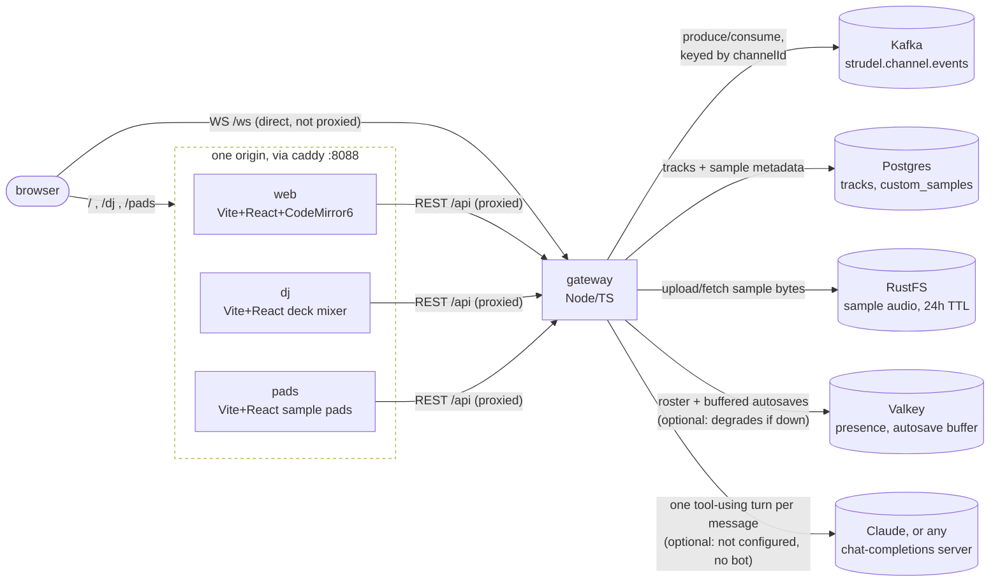
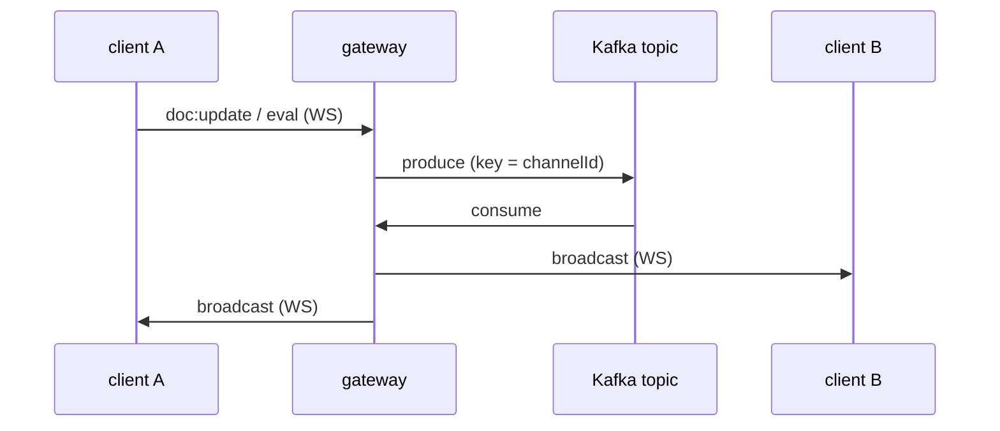
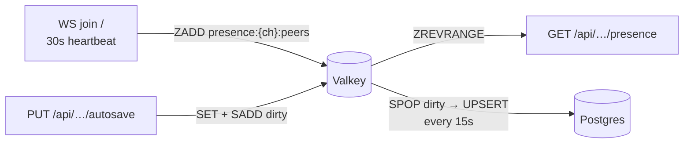
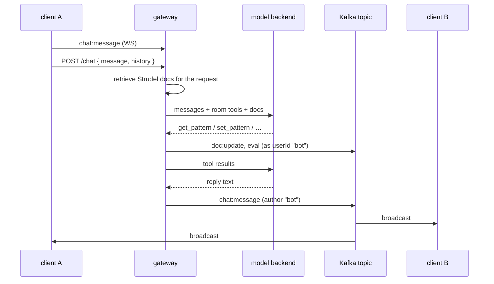
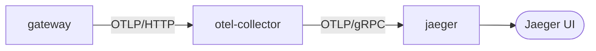

# strudel-point

A [flok.cc](https://flok.cc)-style collaborative live-coding room for [Strudel](https://strudel.cc),
with Kafka as the event backbone between clients, Postgres for saved tracks/metadata, RustFS
(S3-compatible object storage) for user-uploaded audio, and Valkey for cross-instance presence
and autosave buffering.

## Architecture



Every client app speaks the same two protocols to the same gateway: **WebSocket `/ws`** for realtime room events, and **REST `/api`** for tracks and samples. `/ws` is the one exception to "browser never talks to the gateway directly" — it bypasses Caddy/Vite's proxy entirely (a proxied WS upgrade hangs forever under Bun's `http.request`), so the gateway's port is published straight to the browser. `/api` goes the normal route: browser → app's own Vite dev server → its proxy → gateway.

### Why events go through Kafka instead of a direct broadcast



The gateway never fans an event out on receipt — it only ever broadcasts what it *consumes back* off Kafka, including to the sender. That keeps behavior identical whether one gateway instance is running or ten, and gives a durable, replayable log for free.

Everything except the web container's own port is **internal to the Docker network** —
gateway talks to `kafka:9092`/`postgres:5432`/`rustfs:9000`/`valkey:6379` by Docker's internal DNS, and the
browser never talks to the gateway directly; Vite's own server-side proxy does that from
inside the web container. The only host port that has to exist is the one the browser hits.

- **No CRDT.** Each channel/room has one shared buffer; edits are broadcast as full-content
  `doc:update` events, last write wins. Fine for a "everyone's looking at one editor"
  live-coding session; would need real conflict resolution (e.g. Yjs) for true multi-cursor
  concurrent editing.
- **Kafka is the only fan-out path.** The WS gateway never broadcasts directly on receipt —
  it publishes to Kafka, then broadcasts whatever it consumes back off the topic. This keeps
  behavior identical whether one gateway instance is running or several, and gives you a
  durable, replayable event log for free.
- **Audio happens per-browser.** Like flok.cc, nobody's audio is server-rendered — every
  client runs its own `@strudel/web` instance and locally evaluates whatever `eval` events
  come through, so everyone in the room hears the pattern.
- **Presence is a Valkey sorted set, not the event stream.** `GET
  /api/channels/:id/presence` returns the full roster across every gateway instance, so a
  client joining a busy room sees who's already there rather than only learning about
  arrivals after it connected. See the Valkey section below.

## Valkey: presence and the autosave buffer

Valkey used to *hold* custom sample audio — the only copy, which is why it had a 5MB cap and
why losing it lost data. `storage.ts` owns those bytes now. It's back in a narrower role, and
the rule that keeps it honest is that **nothing in it is a system of record**: everything here
is either re-derived (presence) or has a durable copy elsewhere (autosaves → Postgres).



**Presence** (`apps/gateway/src/presence.ts`). This is the one thing the Kafka fan-out design
can't give you: every instance runs its own consumer group and broadcasts to its own sockets,
which is exactly why no instance knows who's connected to any other. `rooms.ts` is a plain
in-process `Map`, so `peerCount` used to mean "peers on whichever instance you happened to
ask" — and a client's peer list was join-order-only, missing everyone already in the room.
A sorted set per channel, scored by last-seen timestamp, fixes both: the score doubles as the
liveness reaper for sockets that died without a clean close (reaped on read, so there's no
per-channel background sweep). The ws heartbeat in `index.ts` refreshes the score on the same
30s tick it pings on, and a peer drops off the roster after three consecutive misses.

**Autosave buffering** (`apps/gateway/src/autosaveBuffer.ts`). The web client debounces
autosave to 3s and also fires one on every evaluate, so a room with someone actively typing
was doing an UPSERT into `autosaves` every few seconds, forever, for a row nobody reads until
a reload. Writes now land in Valkey and mark the channel dirty; a flusher drains the dirty set
into Postgres every 15s (and once more on shutdown). Postgres is still the durable copy — this
changed *when* it's written, not whether.

The honest trade: losing Valkey between flushes loses up to 15s of autosave. That's acceptable
*here specifically* because autosave is already the explicitly lossy tier — a debounced
best-effort snapshot, deliberately distinct from a saved `Track`, which still writes straight
to Postgres synchronously. It would not be acceptable for tracks, and the pattern shouldn't be
copied there.

The flusher is safe to run on every instance concurrently: `SPOP` *claims* channels atomically,
so two instances can't flush the same one, and a write landing after the pop simply re-adds the
channel for the next tick (rather than being lost, which is what read-then-`SREM` would do).

**It's optional, and that's enforced in code, not just documented.** The client runs with
`enableOfflineQueue: false`, so when Valkey is down commands fail on the first attempt instead
of buffering and firing late — every call goes through one `withValkey()` helper that falls
back to the lesser thing: presence degrades to per-instance (the old behavior), autosave writes
straight through to Postgres. `docker-compose.yml` depends on it with `service_started`, not
`service_healthy`, for the same reason. Watch
`gateway_valkey_errors_total` in Prometheus — that counter is the only outward sign a request
took the degraded path. Verified both directions: with Valkey down the gateway starts and
serves normally, and it reconnects on its own once Valkey comes back.

The compose service has no volume, deliberately, and runs `--maxmemory-policy allkeys-lru`:
eviction here is a cache miss, not data loss.

## `tracks` table

```sql
tracks (
  id            uuid primary key,
  channel_id    text,
  title         text,
  author        text,
  code          text,         -- raw source, as typed
  strudel_json  jsonb,        -- { code, cps?, tags?, version } — see packages/shared/src/tracks.ts
  created_at    timestamptz,
  updated_at    timestamptz
)
```

`strudel_json` is deliberately a superset of `code` (not just the string) so future fields —
tempo, tags, multi-pane layouts — don't need a schema migration, just a jsonb shape change.

## Custom sounds (drag-and-drop audio)

Dropping an audio file into the "my sounds" tab uploads it and registers it with Strudel by
name (`s("myclap")`), broadcasting to everyone else in the room over the same Kafka topic.

The audio bytes themselves live in **RustFS, not Postgres** — `custom_samples` only holds
metadata (name, size, mime type). This was a deliberate change from an earlier bytea-in-Postgres
version: uploaded audio is session-scoped, throwaway material, not something that should grow a
database backup forever. Instead:

- Bytes expire after a **fixed 24h**, via a bucket lifecycle rule (`apps/gateway/src/storage.ts`,
  `SAMPLE_TTL_DAYS`) — set once at startup, not per-upload. Unlike the Valkey-backed cache this
  replaced, that expiry is *not* refreshed on play: object storage has no last-accessed hook to
  reset against, so an actively-used sound can still age out mid-session at the 24h mark. If that
  turns out to matter in practice, it'd need an app-level "touch" on every play instead.
- The metadata row is deleted the moment its object is found expired (checked when the sidebar
  list loads, or on a playback 404) — so Postgres never accumulates dead rows either.
- Upload cap is 50MB — real object storage, not a RAM-backed cache, so this is a "keep it to one
  sample/loop" guard rail rather than a memory constraint.

If you want a custom sound to genuinely outlive 24h of inactivity, save it as part of a `Track`
(the `code` references the sample by name; re-upload the audio in a fresh session) — tracks and
custom sounds are deliberately different durability tiers.

## Audio needs a secure context

**Sound only works over HTTPS, or on `localhost`.** Not over plain HTTP from a LAN address,
a tailnet IP, or a hostname — the app loads, the editor works, chat works, patterns
evaluate, and nothing makes a sound.

Strudel's audio engine builds `new AudioWorkletNode(...)` (superdough's `helpers.mjs` and
`dspworklet.mjs`), and **AudioWorklet is a secure-context-only API**. On an insecure origin
the browser doesn't define the global at all, so the first attempt to play fails with:

```
ReferenceError: AudioWorkletNode is not defined
```

which names a browser internal, mentions neither HTTPS nor the origin, and sends you looking
for a bug in the pattern. There isn't one — no pattern can work on that origin.

`insecureContextWarning()` (`apps/web/src/strudel.ts`) checks `window.isSecureContext` on
load and says so up front, including that everything *except* audio still works — without
that last part the banner reads as "this deployment is broken", which it isn't.

What this means for deployment:

| Origin | Audio |
| --- | --- |
| `https://your.domain` | works — the normal production shape, TLS terminated in front of caddy |
| `http://localhost:8088` | works — localhost is a secure context by definition |
| `http://192.168.1.5:8088`, `http://100.x.y.z:8088` | **no audio** |

So a stack reached over a tailnet or LAN needs TLS in front of it even though nothing is
public. On a tailnet, `tailscale serve --bg 8088` does it with a real certificate (requires
HTTPS Certificates enabled for the tailnet), which is a secure context and therefore has
working audio.

## strudelbot and byte sonification

The sidebar's **chat** tab is two features sharing one panel, and they're independent on
purpose: one needs a model configured, the other never leaves the browser.

### The bot

Typing in the panel does two things. The message goes out over the socket as a
`chat:message` event, so the other humans see it — that half works with nothing configured
at all — and it's also POSTed to `/api/channels/:id/chat`, where the gateway runs one
tool-using turn against a model and publishes the reply back onto the *same Kafka topic* as
every other event.



Three consequences worth stating outright:

- **The bot has no privileged path into a room.** Its tools (`apps/gateway/src/chat/tools.ts`)
  change a room by publishing the same `doc:update` / `eval` / `hush` events a browser
  publishes, stamped with `userId: "bot"`. A bot edit and a human edit are indistinguishable
  downstream, which is why nothing in the client needed a special case for it.
- **No tool takes a channelId.** They're built inside a closure over the one channel the
  request named, so "now go edit room `lobby`" injected through chat has nothing to call.
  `load_track` and `sonify_bytes` scope their SQL by channel too — an id pasted into chat
  can't read another room's work.
- **Nothing about a conversation is stored server-side.** Every browser in the room already
  receives every `chat:message`, so they all hold the same transcript for free; the client
  that typed sends its view back as `history` (capped at `CHAT_HISTORY_LIMIT`, re-capped on
  the gateway since that's the side paying for tokens). Any instance can serve any turn.

### What the bot knows about Strudel

Seven tools, all of which act on the room — `get_pattern`, `set_pattern`, `hush`,
`list_sounds`, `list_tracks`, `load_track`, `sonify_bytes`. **None of them is a
documentation lookup**, on purpose.

Before the first model call, the turn scores Strudel's entire API against the request and
puts the relevant slice into the system prompt: 14 functions with their descriptions and a
real example each, inside a ~5kB budget. `apps/gateway/src/chat/retrieval.ts`.

That started as two tools — `lookup_function` and `search_docs` — and they worked, in the
sense that the model used them correctly. That was the problem. A turn is bounded by
`MAX_ITERATIONS`, and a local 9B model asked for a drum pattern spent **six of its ten
iterations** looking things up and then ran out before it could answer. The answers were
always going to come from a 1,000-entry index sitting in memory; asking for them one at a
time was the expensive way to read a local file. Retrieval takes a few milliseconds, happens
once, and costs no iterations at all. Same request afterwards: **two tool calls, 7.7
seconds, an actual reply.**

What goes in the block:

| | |
| --- | --- |
| query hits, in rank order | what was asked, so the best answer is what the model reads first |
| every function the buffer already uses | editing without the docs for what's there is how "make it faster" becomes an accidental rewrite |
| the foundations | `s`, `n`, `note`, `sound`, `scale`, `slow` — no request ever names them ("a kick with a hat on the offbeat" needs `s` and mentions nothing like it) |

The foundations are **derived, not listed** — counted from how often each name appears
across the index's own examples. The documentation already knows which functions are
fundamental, and a list typed out here would be one more thing to be wrong about after an
upgrade.

Scoring is ordinary TF-IDF with a few things the tests pin, each of which was a wrong answer
first:

- **Length-normalised term frequency.** `room` says "reverb" once; `roomlp`, `roomdim` and
  `roomfade` describe how the reverb *behaves* and repeat the word. Raw counts answered "add
  reverb" with the parameters instead of the function.
- **Name matches weighted by how informative the word is.** "pattern" appears in half of all
  requests and is also a real export, next to `isPattern` and `patternifyAST`. A flat bonus
  made the base class the top hit for most questions.
- **Stemming plus prefix matching.** English inflects and Strudel abbreviates: "reversing"
  has to reach `rev`, "faster" has to reach `fast`. Stemming alone turns "reverse" into
  "revers", which matches neither.
- **Undocumented names demoted, not dropped.** Strudel's internals match on name fragments
  and would otherwise crowd out the functions a person asking a question wants.

### Mini-notation, samples and scales

The function index covers functions. It cannot cover the things a small model actually gets
wrong, because they aren't functions:

- **mini-notation** — `~`, `*4`, `[a b]`, `<a b>`, `(3,8)`, `@3`, `!3` — is a *grammar*
- **sample names** (`bd`, `hh`, `808`) and **scale names** (`minor pentatonic`) are *data*,
  fetched at runtime

Every failure observed from a local 9B model landed in that gap: `4` used as a rest, and
`s("4*4")` as a drum pattern. The function index it did have was never the part it got wrong.

`scripts/build-strudel-vocab.ts` generates `strudelVocabulary.json`: **237 sample names, 71
banks, 92 scales, 13 mini-notation forms.** Samples and banks come from the same pinned
manifests `apps/web/src/strudel.ts` prebakes, so the names are exactly the ones that resolve
in the browser this bot writes for; scales come from `@tonaljs/tonal`, which is what
`.scale()` resolves against. Regenerate with `bun run build:strudel-vocab` (it keeps the
previous list if a manifest is unreachable, rather than silently shipping an empty
vocabulary).

Mini-notation is the one part that can't be derived — it's a grammar, not a list. So every
example in the table is **parsed with Strudel's own krill parser at build time**, and the
build fails rather than shipping a syntax hint that is itself wrong.

Mini-notation and sample names go into every turn. Scales (92) and banks (71) are long lists
that only some requests need, so they're included when the request or the buffer suggests
they will be — a model reading 90 scale names to add a hi-hat is spending attention it needs
elsewhere.

### Three gates on what reaches the buffer

`validatePattern` runs before anything is written, because a shared buffer makes a bad write
everyone's problem rather than the asker's:

| | | |
| --- | --- | --- |
| **JavaScript syntax** | `new Function` | hard — nothing is written |
| **Mini-notation** | Strudel's own krill parser | hard — nothing is written |
| **Dropped patterns** | acorn, over the top-level statements | hard — nothing is written |
| **Argument counts** | arity + silencing, measured off Strudel itself | hard — nothing is written |
| **Sound names** | the generated sample list + the room's uploads | soft — written, not played |
| **Function names** | the generated API index | soft — written, not played |

The first two are certain: they're the same parsers the browser runs, so anything they
reject would have thrown for everyone in the room. `s("bd*")` is perfectly good JavaScript
containing a string, and throws the moment anyone evaluates it — only the second gate sees
that.

The third catches what the other two can't: a name that is valid JavaScript, valid
mini-notation, and resolves to no audio. `s("4*4")` is all three — `4` is a legal
mini-notation word that loads nothing — and silence is the hardest failure to debug from
inside a room, because nothing throws and nobody can hear the cause. It stays soft because a
room can upload its own samples, so the built-in list is necessarily incomplete; the check
takes the channel's custom sample names alongside it.

The third catches the one that doesn't fail at all. These two are valid Strudel that runs:

```js
s("bd hh").every(2).sound("808"), s("hh*4").every(2)   // comma operator, not a stack
s("bd*4")                                              // two top-level statements
s("hh*8")
```

Strudel's own transpiler shows what happens to them — `return s(m('bd*4')), s(m('hh*8'))` and
`s(m('bd*4')); return s(m('hh*8'));`. In both, every pattern but the last is computed and
thrown away. Nothing errors, nothing logs; the room just hears half of what was written,
which from inside a room is indistinguishable from the model having written the wrong thing.
`$:` labels are the supported way to play several at once (the transpiler gives each a
`.p('$')`) and are left alone, as are calls whose value is *meant* to be discarded —
`setcpm(30)` has already taken effect by the time its result is dropped.

The fourth catches what runs, parses, and is a single pattern — and still fails. Verbatim
from the bot once the first three gates were in place:

```js
s("bd hh*2").every(2)   // .every() expects 2 inputs but got 1.  — throws on evaluate
s("bd hh").fast()       // queries to zero events                — no error, no sound
```

Both are measured off Strudel rather than read out of a signature, because the rule lives in
`register()` and is a property of *arity*, not of the parameter list (`pattern.mjs`):

```js
if (arity === 2 && args.length !== 1) { args = [sequence(...args)]; }
else if (arity !== args.length + 1) { throw `.${name}() expects ${arity - 1} inputs` }
```

So arity-2 methods swallow any number of arguments — `.fast()`, `.fast(2)` and `.fast(2,3)`
are all accepted — and everything else demands exactly one number of them. `Function.length`
is 0 for every one of these (they're curried), so the generator calls each method with 0 and
then 1 arguments and reads the requirement out of Strudel's own error message: **63 of 210
chain methods enforce an exact count.**

The second line is the quieter half of the same rule. That `sequence(...args)` with no
arguments *is silence*, so `.fast()` returns a pattern of zero events — Strudel raises
nothing and the room simply hears nothing. Same probe, different question: call it with no
arguments and see whether the result still has events. **97 methods silence a pattern this
way**, while `.room()` and `.gain()` with no arguments are perfectly fine, and nothing in
their signatures distinguishes them.

Only chains rooted at a pattern function are checked, so `[1, 2].filter(f)` is never mistaken
for Strudel's `filter`, and spread arguments are skipped rather than guessed at.

Sound names are extracted from the *parsed* mini-notation tree, walking `source_` and never
`options_`. That distinction is the whole thing: in `bd*4` the parser puts `bd` in the
pattern and the `4` in an operator's arguments, so a scan that treats every token alike
reports the multiplier as a missing sample — a warning on correct code, which is precisely
the failure that made the old hand-written allowlist worse than nothing.

### Where the index comes from

`scripts/build-strudel-api.ts` generates `apps/gateway/src/chat/strudelApi.json` from the
**installed** `@strudel` packages — 1,057 names, 482 with descriptions, 385 with runnable
examples, the same text that builds strudel.cc. Regenerate after upgrading Strudel:

```sh
bun run build:strudel-api
```

Two passes, because neither alone is enough. A runtime pass imports each module and
enumerates its exported functions plus `Pattern.prototype`, which is the only way to see the
several hundred names `register()` and `registerControl()` create at load time. A JSDoc pass
over the same files supplies the prose. Pass one answers *does this exist*; pass two answers
*what is it for*. (`@strudel/core`'s barrel import throws — its `@kabelsalat/web` dependency
doesn't export the `SalatRepl` it asks for — so the generator stubs that one module and
imports the sources directly.)

This exists because a model with no way to check a name will invent one, and inventing one
isn't a private mistake: it lands in a buffer everyone in the room is looking at. But the
first attempt at preventing that was a hand-written allowlist of "real" Strudel functions,
and **it made things worse**. The list was missing `beat`, `loop` and hundreds of others, so
the bot wrote correct code, was told it was wrong, rewrote it into something worse, and
looped until it ran out of iterations. A validator that cries wolf is worse than no
validator — which is the whole argument for generating the list instead of writing it.

`validatePattern` checks against that same index, and an unknown name comes back with the
nearest real ones (`gian` → `gain`, `setCPM` → `setcpm`) rather than a bare refusal.
Edit-distance suggestions only count when the names start with the same letter: without
that, `wait` "suggests" fast, gain and unit, and a model that reads one useless suggestion
list stops reading them all.

### Which model answers

The tools are the valuable part, and they don't care who calls them — `set_pattern`
publishing a `doc:update` to Kafka is the same work either way. So the tool definitions live
once, against a provider-neutral shape (`apps/gateway/src/chat/types.ts`), and each backend
adapts them to its own wire format:

| `CHAT_PROVIDER` | Transport | Config |
| --- | --- | --- |
| `anthropic` (default) | Claude, via the official `@anthropic-ai/sdk` and its tool runner | `ANTHROPIC_API_KEY`, optional `CHAT_MODEL` (default `claude-opus-5`) |
| `openai-compatible` | `POST {base}/chat/completions`, raw `fetch` and a manual tool loop | `CHAT_BASE_URL`, `CHAT_MODEL` (**required**), optional `CHAT_API_KEY`, `CHAT_DISABLE_THINKING` |

The second one covers Ollama, vLLM, LM Studio, llama.cpp's server, OpenRouter, Together and
OpenAI itself — that protocol is the one thing nearly every non-Anthropic runtime agrees on,
so implementing it once makes "run this room off a local Llama" a config change rather than a
rewrite. It's raw `fetch` on purpose: adding the `openai` package would pin a half-dozen
non-OpenAI servers to one vendor's client for a surface that is one POST and a loop. The
Claude path is the opposite call — the official SDK exists there and is the supported way in.

Two things the seam has to absorb, both covered by tests in
`chat/backends/openaiCompatible.test.ts`:

- **Tool arguments arrive as a JSON string per the spec, and as an already-parsed object
  from Ollama.** Accepting both costs three lines; assuming one is a tool that silently
  never runs.
- **Some servers omit tool-call ids**, which the loop still needs to pair a result with its
  call — so it synthesises one and uses the same value on both sides.
- **Reasoning models spend most of a turn on tokens nobody in the room ever sees.**
  `CHAT_DISABLE_THINKING=true` adds `chat_template_kwargs: {enable_thinking: false}`, which
  vLLM, MLX and Ollama pass through to the chat template (the Qwen family reads it; against
  an MLX-served Qwen3.5 derivative here, the same question came back in 0.9s/25 tokens
  instead of 2.5s/122). It is **opt-in** rather than always-on because it is a passthrough to
  the template, not part of the OpenAI protocol — a server that doesn't know the field may
  reject the whole request instead of ignoring it.

A tool that throws (bad arguments, Postgres down, an expired object in storage) comes back to
the model as a tool result rather than a 500, in both backends, so it can route around the
failure and tell the room what happened. Smaller local models lean on the tool descriptions
harder than Claude does, which is why those descriptions say what a tool *does to the room*
rather than just what it takes.

Running it against a local model, with the key in [fnox](https://github.com/jdx/fnox) — the
env var name in the vault won't be `CHAT_API_KEY`, so map it on the way in:

```sh
# one turn against a live server, without needing Kafka/Postgres/Wasabi up
fnox exec -- sh -c 'CHAT_API_KEY=$OMLX_KEY bun scripts/chat-probe.ts "add an open hat"'

# the real stack
fnox exec -- sh -c 'CHAT_API_KEY=$OMLX_KEY docker compose up -d'
```

`scripts/chat-probe.ts` runs one turn through the real backend with the real tool schemas and
prompt, but writes to memory instead of the room — it's the only way to find out whether a
given model actually drives these tools, which the stubbed unit tests can't tell you. It is
deliberately not part of `bun run test`: it needs a live server and costs a real inference.

With nothing configured the routes still answer — `GET /api/chat/status` reports
`enabled: false` **and the reason** ("CHAT_PROVIDER=openai-compatible needs CHAT_BASE_URL"),
and the panel prints it instead of failing on send. Note that on a hosted provider, turns are
billed to your key and **anyone with the room URL can spend it**; rooms are open, like
everything else here (see "What's not here yet"). Pointing `CHAT_BASE_URL` at a self-hosted
model is the cheap way out of that.

### Bytes → number sequence

Drop any file onto the chat panel — an image, a binary, a PDF, anything — and its bytes
become a sequence of numbers, **appended to the bottom of the buffer and commented out**:

```js
// 1225 bytes of "package.json" -> 21 steps, values 0..7
n("3 5 ~ 2  4 4 1 ~  0 6 2 2  ~ 7 3 3  1 ~ 5 4  0")
```

Numbers and rests, nothing else. Choosing a key, a mode, a tempo and a drum kit for you
would be picking the song; this picks the notes and leaves the song alone — chain whatever
instrument you want onto it:

```js
n("3 5 ~ 2").scale("c3:minor").sound("sawtooth")
n("3 5 ~ 2").sound("piano")
```

Commented, and appended rather than written as the pattern. The buffer is shared and
probably playing: replacing it means someone else's work disappears mid-session because a
third person dropped a PNG on a chat panel. As a comment the drop changes nothing about what
the room hears — it arrives as material, and whoever wants it uncomments it.

`bytesToSequence` (`packages/shared/src/bytes.ts`) is a pure function over a `Uint8Array`, so
the file never leaves the browser: a 30MB drop costs one local pass and a `doc:update`, not
an upload.

The mapping is fixed and documented rather than random, because the point is to hear *the
file*:

| Input | Drives |
| --- | --- |
| the file folded into N buckets (`acc * 31 + byte`, every byte, in order) | one step each |
| high nibble | which number, `0..range-1` |
| low nibble | whether that step sounds at all, or rests |
| whole-file checksum | how long the sequence is, within the min/max band |

The two nibbles are read separately on purpose: gate the rests on the same bits that pick
the number and the rests only ever land on certain numbers. Length is part of what a file
"is" too, so by default the checksum picks it (8–32 steps) rather than every file coming out
the same shape — pass `steps` to fix it, or `minSteps`/`maxSteps` to move the band.

| Option | Default | |
| --- | --- | --- |
| `steps` | *from the bytes* | fix the length instead of deriving it |
| `minSteps` / `maxSteps` | 8 / 32 | the band the bytes may choose from |
| `range` | 8 | numbers run `0..range-1` |
| `rest` | 0.25 | share of steps that are `~`; `0` gives none |

Same bytes always give the same sequence; a single flipped byte anywhere gives a different
one. Two PNGs out of the same encoder rhyme, a PNG and a zip don't. An empty file is all
rests — silence is the honest answer for no bytes.

The bot has the same mapping as its `sonify_bytes` tool, pointed at a sample already
uploaded to the room — so "make that byte pattern less busy" refines exactly what the room
just heard, rather than a second, different sonification. It can pass `range` and `rest`,
which is what "less busy" turns into.

## DJ mixing (`apps/dj`)

A separate app (own Vite dev server, own `docker-compose.yml` service) that turns a room's
*existing saved Tracks* into a two-deck DJ mixer. dj's whole job is playing tracks that
already exist — it never touches audio files or sample banks; that's `apps/pads`'s job
(below). A deck here holds a whole `Track`'s Strudel source, not decoded audio, so there's
no waveform, no bpm-guessing, no scrubbing — just code, played (and shaped) as whatever it
already is:

- **Decks play whole tracks** — each deck picks from this room's saved tracks and plays
  the pattern as-is, `.speed()`-shifted and optionally filtered.
- **hpf/lpf/lfo/duck knobs** — a highpass, a lowpass (with an lfo that sweeps its cutoff),
  and a "duck": a rhythmic, cycle-synced gain dip for a sidechain-pump feel. Explicitly
  *not* a true audio-reactive sidechain compressor — that would need an envelope follower
  actually listening to the other deck's live output, which is real Web Audio graph work
  Strudel's pattern language doesn't do. See `chain.ts`'s `DeckConfig` for the honest
  version this actually is.
- **Tempo** — a deck's effective tempo is whatever its track's own `setcps()` declared
  (parsed back out by `splitTrackCode`) times its `.speed()` knob; a track with no
  declared tempo falls back to a default rather than guessing one. "sync" matches a
  deck's speed to whichever deck is "master".
- **Crossfader** — equal-power crossfade between the two decks' gains.
- **A hard "cut"** — Strudel's `evaluate()` only affects what gets scheduled *going
  forward*; it never retroactively silences a track already sounding, and there's no
  per-deck kill switch in Strudel's public API. "cut" is the honest version of "stop
  immediately": it hushes the whole mix for an instant, marks that deck stopped, and lets
  the next debounced re-evaluate bring the other deck back in without it.
- **Show code** — a toggle reveals the actual Strudel driving the live mix (every knob is
  just recompiling this), and you can edit it directly; touching any knob/deck reverts to
  knob-generated code.
- **Sync with the room** — every knob/fader move recompiles the mix into real Strudel
  source and evaluates it locally, then broadcasts it as the same `eval` event the main
  editor sends on ctrl+enter. Everyone in the room hears the live mix; Strudel hot-swaps
  the running pattern rather than restarting it, so this is a continuous remix, not a
  series of restarts.
- **Sets as a chain, saved as a Track** — "add scene" freezes the current mix for N
  cycles into an ordered chain, auto-saved as one Strudel track (`arrange()` under the
  hood) through the existing Tracks API — a normal `Track`, playable from the main editor
  too, shareable as a URL carrying both the room number and the set:
  `.../dj/?track=<id>#<room>`.

No gateway/database changes were needed for any of this — it's a client reusing the same
REST/WS surface the main app already exposes.

## Sample pads (`apps/pads`)

A third app, split out from what used to live inside `apps/dj`: cutting an uploaded audio
file into a bank of one-cycle slices (drag-drop → analyze → cut, same "analyze beat"
technique `BeatAnalyzer` uses) and triggering those slices from a 16-pad grid. This is
where sample banks actually get created and played as one-shots — dj never handles raw
audio at all anymore, only the Tracks this (or the main) app already saved.

## Running locally

Everything runs as Docker containers — Kafka, Postgres, RustFS, Valkey, the gateway, and the
web dev server. `mise trust` once if this is the first time mise has seen this directory, then:

```sh
mise install       # installs bun at the pinned version (used for one-off scripts + host tooling)
mise run docker:up # builds + starts everything (Kafka, Postgres, RustFS, Valkey, gateway, web)
mise run migrate   # applies db/migrations/*.sql, run from inside the gateway container
mise run dev       # follows gateway + web logs (docker:up already started them)
```

`mise run install` (plain `bun install` on the host) is separate and optional — it's only for
your editor's TypeScript server / running `tsc --noEmit` locally, since the containers install
their own copy of `node_modules` at build time (deliberately: this is a monorepo built on macOS
ARM but the containers are Linux, and something like Vite's `esbuild` ships platform-specific
native binaries — sharing a host-installed `node_modules` into the container would just break).

Kafka/Postgres/RustFS/Valkey publish **no host ports at all** — nothing to collide with, since the
gateway reaches them by Docker-internal DNS name instead of `localhost:<port>`. The one port
that does need to reach your browser (Vite's dev server) is published as a small range —
`5173-5178:5173` — so Docker itself binds whichever's actually free; run `docker compose port
web 5173` (or just `docker compose ps`) to see which one it picked if 5173 was already taken.

Open `http://localhost:5173/#my-room` (or whichever port got picked) — the text after `#` is the
channel/room id. Open the same URL in a second tab (or another browser) to see live collaboration.

- `⌘/Ctrl + Enter` — evaluate the current buffer
- `⌘/Ctrl + .` — hush (stop all sound in this browser)
- **save** — writes the current buffer to Postgres as a `Track`
- **chat tab** — room chat, plus strudelbot if the gateway has a model configured (Claude by
  default, or any chat-completions server); drop any file on it to turn its bytes into a
  pattern (no model needed for that half)

## Running in production

`docker-compose.yml` is the development stack and only that — bind-mounted source, Vite
dev servers, `bun --watch`. `docker-compose.prod.yml` is the deployable one:

```sh
cp .env.prod.example .env    # fill in POSTGRES_PASSWORD, S3_ACCESS_KEY, S3_SECRET_KEY
docker compose -f docker-compose.prod.yml up -d --build
docker compose -f docker-compose.prod.yml run --rm gateway bun scripts/migrate.js
```

Then point a TLS-terminating reverse proxy at `HTTP_PORT` (default 8088). Three things
are genuinely different from dev, not just tuned:

**One origin, one port.** `Dockerfile.static` builds all four apps as static bundles and
serves them from a single Caddy container (`Caddyfile.prod`), which also proxies `/api`
and `/ws` to the gateway. The gateway publishes no host port. This is why the dev
workaround — the browser dialing the gateway's `:8787` directly for the WebSocket —
disappears in production: that exists purely because Vite's proxy can't complete a WS
upgrade under Bun, and there is no Vite here. Caddy proxies upgrades correctly. So
`apps/*/src/ws.ts` defaults to same-origin whenever `import.meta.env.PROD` is set, which
also keeps the built image hostname-agnostic — no rebuild to deploy it behind a different
domain. `VITE_GATEWAY_WS_HOST` still overrides, for a split-origin deployment.

**No default credentials.** Dev hardcodes `strudel`/`strudel` everywhere. The prod compose
uses `${VAR:?}` for every secret, so the stack refuses to start rather than quietly
running with a password that's published in this repo. `CORS_ORIGIN` defaults to empty,
which the gateway reads as "same-origin, send no CORS headers at all" (see `env.ts`) —
correct here, since the browser never makes a cross-origin request.

**The gateway image is a single bundled file.** `apps/gateway/Dockerfile` runs
`bun build --target=bun`, inlining the workspace packages and every dependency, so the
runtime stage carries `server.js` and nothing else — no `node_modules`, no lockfile. The
migrator is bundled alongside it (`scripts/migrate.js`) with the raw `db/migrations/*.sql`
next to it, since that image is the only place a Postgres client exists. Every migration
is written `if not exists`, so re-running it on each deploy is safe.

Observability is deliberately absent from the prod compose — no Jaeger, no Prometheus, no
collector. Those are dev conveniences; a real deployment usually has its own. Set
`OTEL_EXPORTER_OTLP_ENDPOINT` to emit traces and scrape `gateway:8787/metrics` for
metrics. Note that `/metrics` is *not* proxied through the public origin, so it stays on
the internal network rather than sitting unauthenticated on the front door.

## Telemetry (OpenTelemetry + Jaeger)

The gateway is instrumented with the OpenTelemetry Node SDK (`apps/gateway/src/telemetry.ts`,
imported first thing in `index.ts` so `http`/`express` get patched before anything else
touches them). It exports traces over OTLP/HTTP to an `otel-collector` container, which
forwards them on to `jaeger` (native OTLP, no jaeger-specific exporter needed) for viewing.



Traces cover incoming HTTP requests (`/api/*`), WebSocket handling, and every one of this
app's four backing-service calls — Postgres queries, Kafka produce/consume, RustFS/S3
object calls, and Valkey commands — enough to see, e.g., a `save` request's full path from
`/api/tracks` down through the `pg` query it issued, or a sample upload down through its
`s3.putObject`.

**Why Postgres/Kafka/S3/Valkey use manual spans instead of auto-instrumentation:** the standard
approach (`getNodeAutoInstrumentations()` in `telemetry.ts`) covers `pg`, `kafkajs`, and
friends out of the box — but only via a require/import hook that patches each package the
moment it's loaded, and confirmed against a live run, that hook doesn't fire under Bun for
packages this app reaches through ESM `import` (only Node's own core `http`/`net` modules
still get patched, since those are patched directly rather than via the hook). Rather than
depend on that, `db.ts` (wraps `pool.query` once, so every route gets it for free),
`kafka.ts` (`publishChannelEvent` / the consumer's `eachMessage`), `storage.ts` (every
`putObject`/`getObject`/`statObject`/`removeObject` call), and `valkey.ts` (the one
`withValkey` helper every presence/autosave call goes through) each start their own span by
hand, using the `tracer` `telemetry.ts` exports. Revisit this if a future OTel/Bun release closes
that hook gap — the manual spans could then be dropped in favor of the bundled ones.

- `otel-collector` publishes no host port, same reasoning as kafka/postgres/rustfs — only
  the gateway talks to it, over Docker-internal DNS (`otel-collector:4317`/`4318`).
- `jaeger`'s UI is published as a small range (`16686-16690:16686`), same idea as
  web/dj/pads, so it doesn't collide with another project's Jaeger already sitting on
  16686. Run `docker compose port jaeger 16686` (or `docker compose ps`) to see which port
  got picked, then open `http://localhost:<port>` and search for service
  `strudel-point-gateway`.
- Jaeger's all-in-one image stores traces in memory — they don't survive `docker compose
  down`. Fine for local dev; swap in a real storage backend if you need traces to persist.
- The collector config (`otel/otel-collector-config.yaml`) is the one place to add more
  exporters later (metrics, a hosted backend, etc.) without touching any instrumented app.
- Outside docker-compose (e.g. running the gateway bare on a host), `telemetry.ts` no-ops
  when `OTEL_EXPORTER_OTLP_ENDPOINT` isn't set, rather than failing every request trying
  to reach a collector that isn't there.

## Pointing at Aiven instead of local docker-compose

Copy `apps/gateway/.env.example` to `apps/gateway/.env` and fill in:

- `KAFKA_BROKERS`, `KAFKA_SSL=true`, `KAFKA_SASL_USERNAME`, `KAFKA_SASL_PASSWORD` — from an
  Aiven for Apache Kafka service.
- `DATABASE_URL` — from an Aiven for PostgreSQL service (`sslmode=require`).
- `VALKEY_URL` — from an Aiven for Valkey service. Paste the service URI as-is; the
  `valkeys://` (or `rediss://`) scheme turns TLS on by itself. Optional, like everywhere else
  Valkey shows up here — leave it pointing at nothing and the gateway just runs degraded.
- `S3_ENDPOINT`, `S3_PORT`, `S3_USE_SSL`, `S3_ACCESS_KEY`, `S3_SECRET_KEY` — from wherever you're
  actually running/using S3-compatible object storage. **There's no Aiven-managed equivalent for
  this one** — it'd mean either self-hosting RustFS somewhere real (a VM, a container platform) or
  pointing the same client straight at AWS S3 or another provider instead. Local docker-compose's
  RustFS container is dev-only.

I haven't provisioned any of these yet — say the word and I'll set up the OpenTofu for a
dev-tier Kafka + PostgreSQL + Valkey in project `jay-miller` / `do-nyc`, per your usual setup,
plus we'd need to separately decide where the object storage half actually lives, since that
one's not something Aiven's OpenTofu provider can stand up,
and confirm the exact specs with you before creating anything.

## What's not here yet

- Auth (rooms are open to whoever has the URL, like flok.cc)
- Multi-pane layouts (Strudel/Hydra/Tidal side by side, like flok.cc's real target list)
- Kafka topic retention/compaction tuning (currently whatever the broker defaults to)
- Tests
